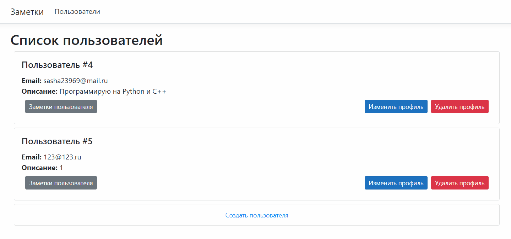

[](https://github.com/bahioganns/Dot_Net_labs/actions/workflows/dotnet.yml)

# Лабораторные работы от 2 до 6

**Тема:** Приложение для заметок



# TODO

## Глобально

- [X] Domain
- [X] DataAccess
- [X] BLL
- [X] BLL.Test
- [X] DTO
- [X] WebAPI
- [X] Curl API examples
- [X] Razor MVC

## Мелочи

- [ ] Валидация User в BLL.Update
- [ ] При удалении пользователя удалять все его заметки
- [ ] Конфигурировать Context внутри WebAPI
- [ ] Логгировать запросы в WebAPI
- [ ] Обрабатывать ошибки в WebAPI, а не кидать Stacktrace
- [ ] Показывать ошибки валидации в MVC
- [ ] В MVC брать адрес WebAPI из одного места, а не дублировать везде

# Заметки по dotnet CLI

```bash
# Создание проектов
mkdir labs
cd labs

dotnet new console -o Domain
dotnet new console -o DataAccess
dotnet new console -o BLL
dotnet new nunit -o BLL.Test
dotnet new classlib -o DTO
dotnet new webapi --no-https --auth None -o WebAPI
dotnet new mvc -o MVC
dotnet new # Список всех возможных типов проектов

# Создание решения и добавление проектов
dotnet new sln
dotnet sln labs.sln add Domain/Domain.csproject
dotnet sln labs.sln add BLL.Test/BLL.Test.csproject

# Использование одного проекта в другом
dotnet add ./DataAccess/ reference ./Domain/

# Cборка, тесты, запуск, см. больше в Makefile
dotnet build labs.sln
dotnet test labs.sln
dotnet run DataAccess

# Установка библиотек
dotnet add ./DataAccess/ package Microsoft.EntityFrameworkCore.Sqlite
dotnet add ./BLL.Test/ package Moq --version 4.16.1
```
